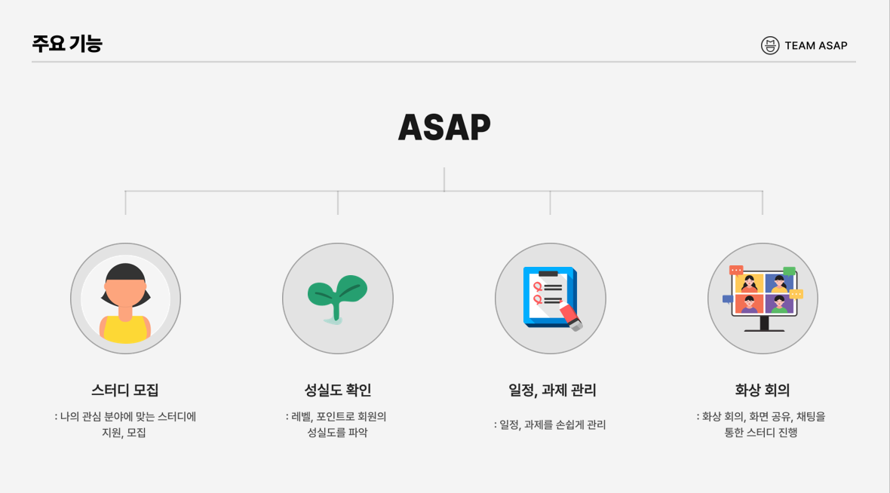
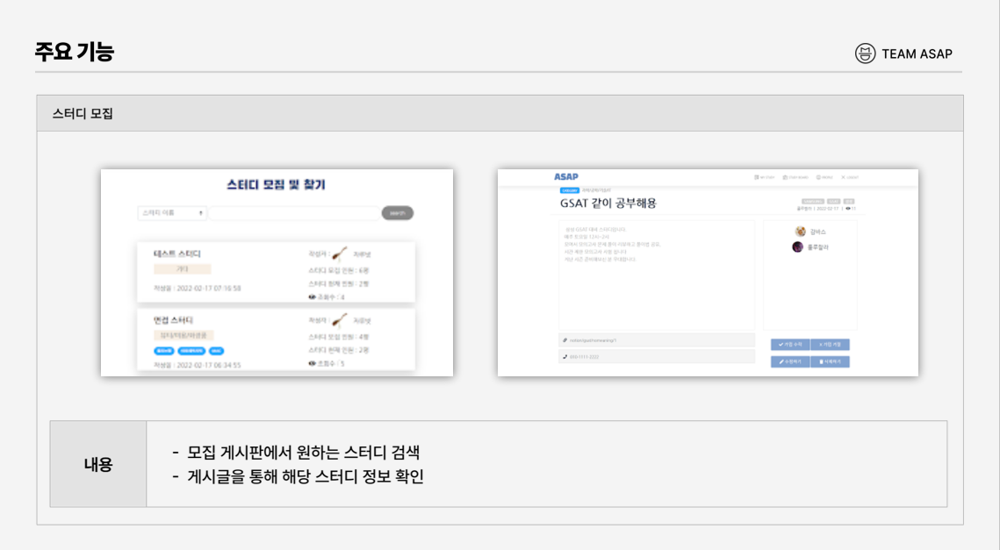
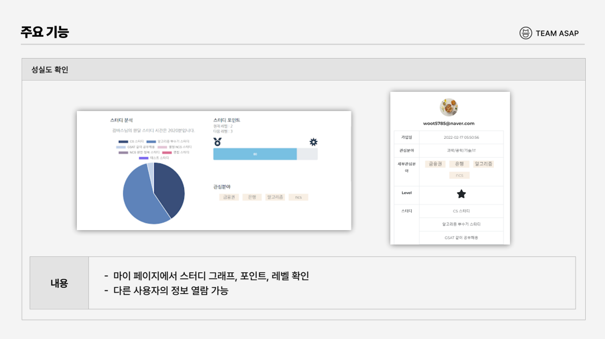
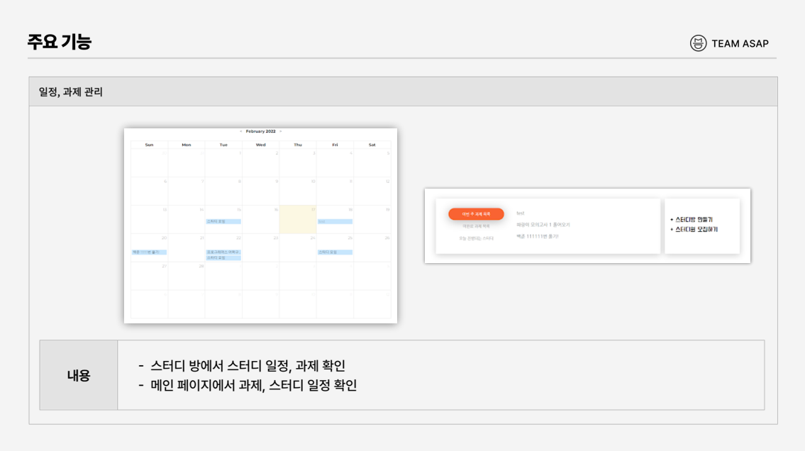
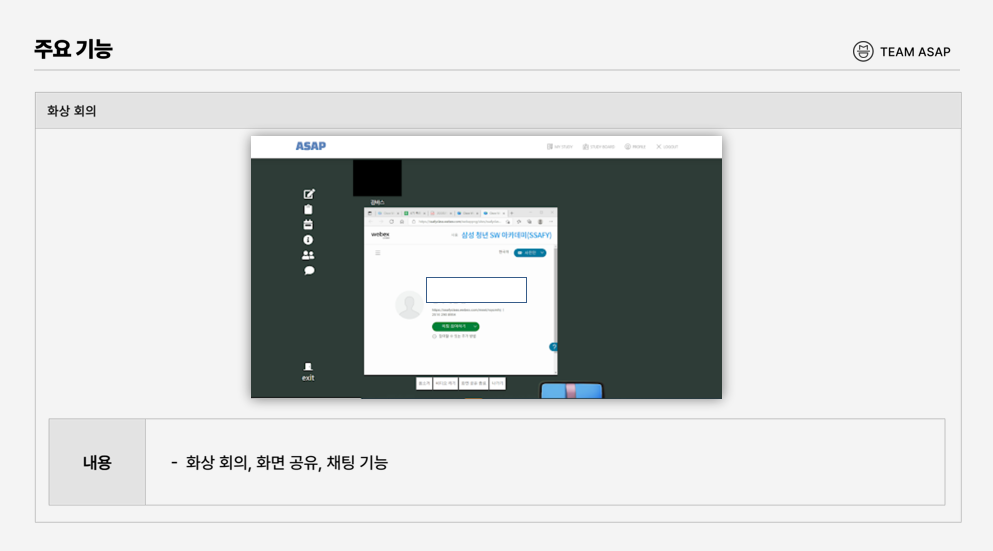
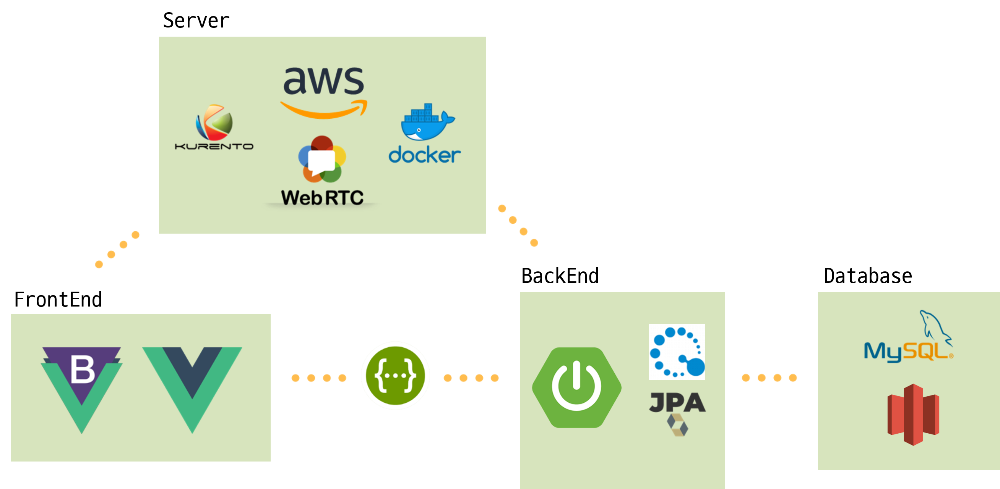

# ASAP

> ASAP은 화상회의를 통한 스터디 진행 뿐만 아니라 과제 업로드, 일정 체크까지 한 곳에서 진행할 수 있는 웹 서비스입니다. 
>
> 또한 사용자의 스터디 진행량을 분석해주고, 사용자는 ASAP을 통해 원하는 스터디에 가입할 수 있고, 찾고 있는 스터디가 없다면 직접 모집할 수도 있습니다.

 

### 목차

[1. 주요 기능](#주요-기능)

[2. 기술 스택](#기술-스택)

[3. 서비스 아키텍처](#서비스-아키텍처)

[4 문서](#문서)

[5. 팀원 소개](#팀원-소개)

 

### 주요 기능

 

### 기술 스택

**협업**

- Jira
- Gitlab
- Notion
- Gather
- Mattermost

**Frontend**

- Vue.js
- Vuex
- HTML/CSS

**Backend**

- WebRTC (KURENTO)
- docker
- aws
- spring boot
- JPA
- querydsl
- MySQL
- firebase

 

### 서비스 아키텍처

 

### 문서

- <a href="https://github.com/1seul357/ASAP/blob/master/%EC%82%B0%EC%B6%9C%EB%AC%BC/A107_ClassDiagram.png">클래스 다이어그램</a>

- <a href="https://github.com/1seul357/ASAP/blob/master/%EC%82%B0%EC%B6%9C%EB%AC%BC/A107_ERD.png">ERD</a>

- <a href="https://github.com/1seul357/FOR-EAT/blob/develop/docs/API_%EB%AA%85%EC%84%B8%EC%84%9C.pdf">API 명세서</a>

- <a href="https://github.com/1seul357/ASAP/blob/master/%EC%82%B0%EC%B6%9C%EB%AC%BC/A107_%EC%99%80%EC%9D%B4%EC%96%B4%ED%94%84%EB%A0%88%EC%9E%84.pdf">와이어프레임</a>
- <a href="https://github.com/1seul357/ASAP/blob/master/%EC%82%B0%EC%B6%9C%EB%AC%BC/A107_%ED%99%94%EC%83%81%EC%B1%84%ED%8C%85_%EC%8B%9C%ED%80%80%EC%8A%A4%EB%8B%A4%EC%9D%B4%EC%96%B4%EA%B7%B8%EB%9E%A8.png">시퀀스 다이어그램</a>

 

### 팀원 소개

`Frontend`: 우윤석, 한슬기

`Backend` : 김민준, 김우찬

`WebRTC` : 고주희, 이호진
